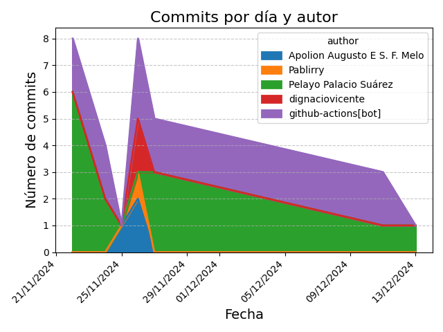

# postgresql-python

## Descripción del Proyecto

Este proyecto tiene como objetivo proporcionar una comprensión profunda de PostgreSQL y Python, en el contexto de la asignatura de Gestión Empresarial para la FP de DAM. El propósito principal es evaluar la eficiencia de los usuarios mediante el seguimiento de tareas y tareas completadas diariamente. Se utiliza Python para gestionar y almacenar estos datos en una base de datos PostgreSQL, y Seaborn para la visualización de los resultados obtenidos.

## Tecnologías Utilizadas

-  **Python**: Para el procesamiento y almacenamiento de datos.
-  **PostgreSQL**: Base de datos relacional para almacenar la información.
-  **Seaborn**: Librería de visualización de datos en Python.
-  **Visual Studio Code**: Editor de código utilizado para el desarrollo.

## Instalación

1. Instala Git desde [aquí](https://git-scm.com/downloads) si no lo tienes instalado.
2. Clona el repositorio:
   1. Crea una carpeta para el repositorio:
      ```sh
      mkdir nombre-de-la-carpeta
      ```
      Reemplaza `nombre-de-la-carpeta` con el nombre que desees para la carpeta.
   2. Navega a la carpeta creada:
      ```sh
      cd nombre-de-la-carpeta
      ```
   3. Clona el repositorio dentro de la carpeta:
      ```sh
      git clone https://github.com/PelayoPS/postgresql-python.git
      ```
3. Navega al directorio del repositorio clonado:
   ```sh
   cd postgresql-python
   ```
4. Crea un entorno virtual para el proyecto con Python 3.10:
   ```sh
   python3.10 -m venv env
   ```
5. Activa el entorno virtual:
   - En Windows:
     ```sh
     .\env\Scripts\activate
     ```
   - En Unix o MacOS:
     ```sh
     source env/bin/activate
     ```
6. Instala las dependencias del proyecto:
   ```sh
   pip install -r requirements.txt
   ```
7. Instala PostgreSQL desde [aquí](https://www.postgresql.org/download/) si no lo tienes instalado.

8. Ejecuta el script principal para iniciar el procesamiento de datos:
   ```sh
   python run.py
   ```

## Gráfico de Commits



## Desarrolladores

- [PelayoPS](https://github.com/PelayoPS) (Team Leader)
- [Apolion-Augusto](https://github.com/Apolion-Augusto)
- [dignaciovicente](https://github.com/dignaciovicente)
- [Gumko92](https://github.com/Gumko92)
- [Pablirry19](https://github.com/Pablirry19)


